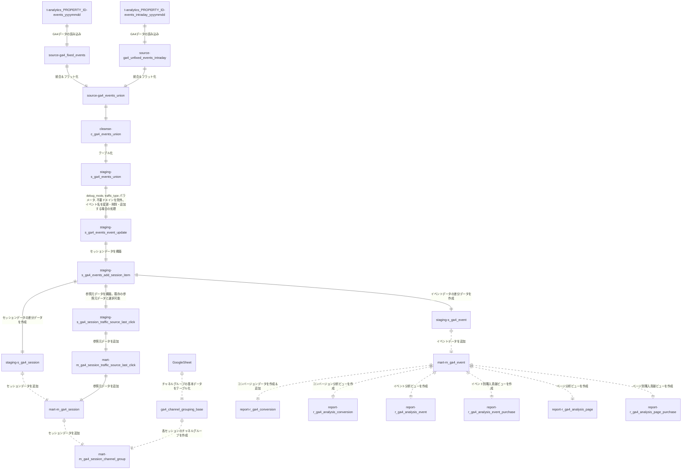

# GA4->BigQuery export data gereral queries made by Dataform.

# 各SQLXファイルの説明

| SQLXファイル名 | 対象 |
| ------------- | ------------- |
| fixed_events.sqlx | クエリ実行の7日前～前日のデータ(テーブル)が対象 |
| unfixed_events_intraday.sqlx | クエリ実行の当日のデータが対象 |
| events_union.sqlx | 上記の両データが対象 |

# ディレクトリ構成
- definitions/ga4/
    - source
       - ga4_fixed_events.sqlx
       - ga4_unfixed_events_intraday.sqlx
       - ga4_events_union.sqlx    
    - cleanse
       - c_ga4_events_union.sqlx
    - staging
       - s_ga4_events_union.sqlx
       - s_ga4_events_event_update.sqlx
       - s_ga4_events_add_session_item.sqlx
       - s_ga4_session_traffic_source_last_click.slqx
       - s_ga4_event.sqlx
       - s_ga4_session.sqlx
    - mart
       - m_ga4_session_channel_group.sqlx
       - m_ga4_session_traffic_source_last_click_delete_unfixed.sqlx
       - m_ga4_session_traffic_source_last_click.slqx
       - m_ga4_events_event_update.sqlx
       - m_ga4_event_delete_unfixed.sqlx
       - m_ga4_event.sqlx
       - m_ga4_session_delete_unfixed.sqlx
       - m_ga4_session.sqlx
    - report
       - r_ga4_conversion_delete_unfixed.sqlx
       - r_ga4_conversion.sqlx
       - r_ga4_analysis_conversion.sqlx
       - r_ga4_analysis_event_purchase.sqlx
       - r_ga4_analysis_event.sqlx
       - r_ga4_analysis_page_purchase.sqlx
       - r_ga4_analysis_page.sqlx
- includes/
    - constatns.js : GCPプロジェクト名、対象ホスト名などの定数をまとめたファイル
    - helpers.js : SQLXを簡略化するための関数が入ったファイル 


# Data Flow



# 処理の流れ
## 1. イベントデータのフラット化とビュー作成
GA4からエクスポートされたテーブル（`analytics_xxxxxxx.events_YYYYMMDD`、`analytics_xxxxxxx.events_intraday_YYYYMMDD`）の`event_params`カラムなどをフラット化し、1つのビューにまとめます。
- **ディレクトリ**: `definitions/ga4/source`
  - 直近4日間のデータは`is_fixed_data`カラムを`false`に設定（ステップ9以降で使用）

## 2. データのクレンジング
生成されたデータに対して以下を実施します。
- **ディレクトリ**: `definitions/ga4/cleanse`
  - イベント発生時刻を日本時間に変更
  - URLからパラメータを除去したカラムを追加
  - `link` URLからパラメータを除去したカラムを追加

## 3. ビュー結果のテーブル化
データをテーブルに格納（テーブル名：`xxx_ga4_staging.s_ga4_events_union`）。
- **ファイル**: `definitions/ga4/staging/s_ga4_events_union.sqlx`

## 4. イベントの除外とカスタマイズ
イベントの除外やデータのカスタマイズを実施します（デフォルトでは何もしません）。
- **ファイル**: `definitions/ga4/staging/s_ga4_events_event_update.sqlx`
  - デバッグモードや内部アクセスのイベントを除外
  - 計測対象のホスト名を指定（指定外は除外）
  - Measurement Protocol用のイベントを含める場合あり

## 5. セッション情報の追加
- **ファイル**: `definitions/ga4/staging/s_ga4_events_add_session_item.sqlx`
  - セッション参照元情報
  - セッション時間
  - ページビュー数（スクリーンビュー数）

## 6. `session_traffic_source_last_click`カラムの別作成
- **ファイル**: `definitions/ga4/staging/s_ga4_session_traffic_source_last_click.sqlx`

## 7. ページビュー/スクリーンビューイベントのデータ追加
- **ファイル**: `definitions/ga4/staging/s_ga4_event.sqlx`
  - 前後3ページのパス
  - ページ滞在時間
  - ランディングページ判定フラグ
  - 直帰、離脱判定フラグ

## 8. セッション参照元データのテーブル格納
- **ファイル**: `definitions/ga4/mart/m_ga4_session_traffic_source_last_click_delete_unfixed.sqlx`
  - 直近データ（`is_fixed_data`が`false`）を削除
- **ファイル**: `definitions/ga4/mart/m_ga4_session_traffic_source_last_click.sqlx`
  - `s_ga4_session_traffic_source_last_click.sqlx`の結果を追加

## 9. イベントデータのテーブル格納
- **ファイル**: `definitions/ga4/mart/m_ga4_event_delete_unfixed.sqlx`
  - 直近データ（`is_fixed_data`が`false`）を削除
- **ファイル**: `definitions/ga4/mart/m_ga4_event.sqlx`
  - ステップ7の結果を追加

## 10. セッション単位のデータ作成
- **ファイル**: `definitions/ga4/staging/s_ga4_session.sqlx`

## 11. セッションデータのテーブル格納
- **ファイル**: `definitions/ga4/mart/m_ga4_session_delete_unfixed.sqlx`
  - 直近データ（`is_fixed_data`が`false`）を削除
- **ファイル**: `definitions/ga4/mart/m_ga4_session.sqlx`
  - ステップ5と`m_ga4_session_traffic_source_last_click`の結果を追加

## 12. チャネルグループの作成
- **ファイル**: `definitions/ga4/mart/m_ga4_session_channel_group.sqlx`
  - 必要に応じて編集
  - 基盤となるテーブルは`molts-data-project.general_master_us.ga4_channel_grouping_base`（Googleシートから作成）

## 13. コンバージョンデータの格納
- **ファイル**: `definitions/ga4/mart/r_ga4_conversion_delete_unfixed.sqlx`
  - 直近データ（`is_fixed_data`が`false`）を削除
- **ファイル**: `definitions/ga4/report/r_ga4_conversion.sqlx`
  - `thanks`ページに到達したイベントを対象
  - 設定: `includes/constants.js`内で`CV_PAGE_LOCATION = 'https://moltsinc.co.jp/%thanks%';`

## 14. 分析ビューの作成
- **ファイル**: `definitions/ga4/report/r_ga4_analysis_conversion.sqlx`
  - コンバージョン分析ビュー
- **ファイル**: `definitions/ga4/report/r_ga4_analysis_event_purchase.sqlx`
  - イベント別購入貢献ビュー
- **ファイル**: `definitions/ga4/report/r_ga4_analysis_event.sqlx`
  - イベント分析ビュー
- **ファイル**: `definitions/ga4/report/r_ga4_analysis_page_purchase.sqlx`
  - ページ別購入貢献ビュー
- **ファイル**: `definitions/ga4/report/r_ga4_analysis_page.sqlx`
  - ページ分析ビュー


# 各セッションの参照元・メディア・キャンペーンの取得手順
## 1. イベントから参照元・メディア・キャンペーンの取得
- 各イベントの`collected_traffic_source.manual_source`を取得（ない場合は`event_params`内の`source`を使用）。
- メディアやキャンペーンも同様に取得。
- **注意**: `collected_traffic_source`カラムは2023年中頃から追加されたため、それ以前の場合は、下記ファイルのコメントアウト部分を変更する必要があります。
  - **対象クエリ**:
    - `source.ga4_fixed_events.sqlx`
    - `source.ga4_unfixed_events_intraday.sqlx`
    - `source.ga4_unfixed_events.sqlx`

## 2. `session_start`イベントから取得
- `session_start`イベントで参照元情報を取得します。

## 3. セッション内の最も古いイベントから取得
- 各セッションで`collected_traffic_source`が存在する最も古いイベントから情報を取得します。

## 4. `session_start`イベントの情報の優先使用
- `session_start`イベントに参照元情報が入っている場合は、それを優先して使用します。
- 入っていない場合は、各セッション内の最も古いイベント（ステップ3）から情報を取得します。
- **対象クエリ（ステップ2以降）**:
  - `staging.ga4_unfixed_events.sqlx`

## 補足: `session_traffic_source_last_click`カラムの使用
- `session_traffic_source_last_click`カラムを使用したい場合は、`xxx_ga4_mart.m_ga4_session_traffic_source_last_click`テーブルに格納されています。
- `m_ga4_event`テーブルや`m_ga4_session`テーブルと`user_pseudo_id`、`ga_session_id`でJOINすることで抽出が可能です。

# チャネルグループの作成＆カスタマイズ手順

## 1. Googleシートの作成
- Googleシートを作成し、チャネルグループを定義します。
  - 例: [Googleシートのリンク](https://docs.google.com/spreadsheets/d/16iDnq9G07HcQ5O09W5OTEPIaq5lbafS8Qw9JGk0179U/edit?gid=0#gid=0)
  - 参考: [Googleサポートページ](https://support.google.com/analytics/answer/9756891?hl=ja)

## 2. BigQueryでのテーブル作成
1. **BigQuery Studio**でプロジェクトを開きます。
2. **データセットを作成**します。
   - データセット名は任意（例: `general_master`）
   - リージョンは他のデータセットと同じに設定（例: `東京` → `asia-northeast1`）
3. **テーブルを作成**します。
   - **ソース**:
     - テーブルの作成元: ドライブ
     - ドライブのURI: GoogleシートのURL
     - ファイル形式: Googleスプレッドシート
     - シート範囲: 空欄のままでOK
   - **送信先**:
     - プロジェクト: デフォルトのまま
     - データセット: デフォルトのまま
     - テーブル名: 任意
4. **注意**: Googleシートへのアクセス権限がないユーザーやサービスアカウントは、このテーブルを使用できない場合があります。その場合、作成したテーブルをコピーして新しいテーブルを作成します。
   - **例**:
     ```sql
     CREATE OR REPLACE TABLE `プロジェクト名.データセット名.新しいテーブル名`
     AS SELECT * FROM `プロジェクト名.データセット名.作成したテーブル名`
     ```
   - 注意: 定義が更新された場合、手動で新しいテーブルにデータを追加する必要があります。参考: [Googleサポートページ](https://support.google.com/analytics/answer/9756891?hl=ja)

## 3. 定数の設定
- `includes/ga4/constants.js`内の`CHANNEL_GROUP_TABLE`変数を、作成したテーブルに変更します。

## 4. カスタマイズ（`m_ga4_session_channel_group.sqlx`）
- `definitions/ga4/mart/m_ga4_session_channel_group.sqlx`で独自ルールを設定します。
  - **85行目以降**: `custom_channel_group` → 各サイトの要件に合わせて変更
  - **119行目以降**: `lp_group` → 各サイトのLPに合わせて変更
  - **125行目以降**: `domain` → 各サイトのドメインやサブドメインのグループ分け定義を変更


# 導入時に変更が必要な箇所

## 1. GA4テーブルがあるプロジェクト
- **includes/constants.js**内でGA4テーブルが存在するプロジェクトを指定します。

## 2. データセット
- 各テーブルのデータセット名とプロジェクト名を指定します。

## 3. 集計対象ホスト名
- クロスドメイントラッキングなどで複数のホスト名が集計対象となる場合、`HOSTNAME3`などを追加し、`module.exports`配列に追加します。

## 4. Measurement Protocolのイベント名
- Measurement Protocolに関連するイベント名を指定します。

## 5. コンバージョン対象の設定
- 現在は`CV_PAGE_LOCATION`を使用していますが、`report/r_ga4_conversion.sqlx`を含めて必要に応じて変更します。

## 6. 新しい定数の作成
- 新しい定数を作成する場合は、このファイル内で作成し、`module.exports`配列に追加します。

# イベントパラメータを追加した場合
**基本的にはすべてのファイルで修正が必要です。**

## 1. `source/s_ga4_fixed_events.sqlx`などの修正
- `event_params`カラムから対象のパラメータを抽出します。
  - 例（114行目）: `${helpers.getEventParamAll('event_category', 'string')}`

## 2. `cleanse/c_ga4_fixed_events.sqlx`などの修正
- 上記で抽出したカラムを追加します。

## 3. `staging/`や`mart/`内のSQLXファイルも同様に修正

# 初回実行時の対応（過去データのインポート、`m_ga4_event`、`m_ga4_session`テーブルの新規作成など）

## 1. `includes/constants.js`の更新
- 前述の内容に従って更新します。

## 2. チャネルグループ用のテーブル作成
- 前述の手順を参照してください。

## 3. `source/ga4_fixed_events.sqlx`の修正
- 最後の`WHERE`句で対象期間を「最も古い日～前日」に変更します（デフォルトは「7日前～前日」）。
  - 例:
    ```sql
    _table_suffix >= FORMAT_DATE("%Y%m%d", DATE_SUB(CURRENT_DATE('Asia/Tokyo'), INTERVAL 1 DAY))
    ```

## 4. `staging/s_ga4_events_add_session_item.sqlx`の修正
- `m_ga4_session`テーブルを参照しているサブクエリを確認し、`mart_session`、`agg_campaign_first_3`サブクエリをコメントアウトし、その下にある`agg_campaign_first_3`を使用します。
  - **注**: 見つからない場合はこの手順は省略可能です（詳細はファイル内に記載）。

## 5. `mart/m_ga4_session_traffic_source_last_click.sqlx`の修正
1. `type`を`incremental`から`table`に変更します。
2. 16行目あたりの`dependencies: ["m_ga4_session_traffic_source_last_click_delete_unfixed"]`をコメントアウトします（`//`を追加）。

## 6. `mart/m_ga4_event.sqlx`、`mart/m_ga4_session.sqlx`の修正
1. `type`を`incremental`から`table`に変更します。
2. 12行目あたりの`dependencies: ["m_ga4_xxxxx_delete_unfixed"]`をコメントアウトします（`//`を追加）。

## 7. `report/r_ga4_conversion.sqlx`の修正
1. `type`を`incremental`から`table`に変更します。
2. 12行目あたりの`dependencies: ["r_ga4_conversion_delete_unfixed"]`をコメントアウトします（`//`を追加）。

## 8. 実行手順
1. 上部の「実行を開始」ボタンをクリックし、「タグ」→「workflow」を選択します。
2. 「SELECTION OF TAGS」が選択されていることを確認します。
   - 「実行するタグ」で「workflow」が選択されていることを確認。
3. 「依存関係を含める」にチェックを入れます。
4. 実行対象として5つのファイルが選択されていることを確認します。
   - `mart/m_ga4_event.sqlx`
   - `mart/m_ga4_session.sqlx`
   - `mart/m_ga4_session_traffic_source_last_click.sqlx`
   - `mart/m_ga4_session_channel_group.sqlx`
   - `report/r_ga4_conversion.sqlx`
5. 下部の「実行を開始」ボタンをクリックして実行を開始します。
6. 「ワークフロー実行を作成しました 詳細」というダイアログが表示されたら、「詳細」をクリックします。
7. ステータスが「成功」になるまで「更新」ボタンを押して確認します。失敗した場合はエラー箇所を確認し、該当のSQLXファイルを修正して再実施します。

## 9. 実行完了後の設定戻し
1. `source/ga4_fixed_events.sqlx`の期間を元に戻します。
2. `staging/s_ga4_events_add_session_item.sqlx`のサブクエリを元に戻します。
3. `mart/m_ga4_session_traffic_source_last_click.sqlx`の`type`と`SELECT`文を元に戻します。
4. `mart/m_ga4_event.sqlx`、`mart/m_ga4_session.sqlx`の`config`（`type`、`dependencies`）を元に戻します。
5. `report/r_ga4_conversion.sqlx`の`config`（`type`、`dependencies`）を元に戻します。

## 10. 再度実行
1. `m_ga4_event.sqlx`と`m_ga4_session.sqlx`、`m_ga4_session_traffic_source_last_click.sqlx`を再度選択して実行します。
   - 実行前に`m_ga4_event`テーブルと`m_ga4_session`テーブルをバックアップとしてコピーしておきます。
2. 実行は前述の「実行」と同じ手順でOKです。
3. 実行後、`event_date`別に件数を調べ、バックアップと比較します。
   - 5日前～前日のデータ件数がコピーしたテーブルより多い場合は作業漏れが考えられます（例: `xxxx_delete_unfixed.sqlx`が実行されていない可能性）。
   - 6日前よりも古いデータがない場合は`type: table`のままになっている可能性があります。

# 日次更新（ワークフロー）の設定手順

## 1. リポジトリの選択
- Dataformのメインページ（[リンク](https://console.cloud.google.com/bigquery/dataform?authuser=0&project=molts-data-project)）にアクセスし、リポジトリを選択します。

## 2. 「リリースとスケジュール」タブの操作
- 「リリースとスケジュール」タブをクリックします。

## 3. リリース構成の作成
- 「リリース構成」の横にある「作成」をクリックし、以下を入力して「保存」を押します。
  - **リリースID**: 任意
  - **頻度**: 毎日
  - **タイムゾーン**: 任意（例: 日本）
  - **Google Cloud プロジェクト リリースID**: 空欄
  - **スキーマの接尾辞**: 空欄
  - **テーブルの接頭辞**: 空欄

## 4. ワークフロー構成の作成
- 「ワークフロー構成」の横にある「作成」をクリックし、以下を設定します。
  - **リリース構成**: 上記で作成したリリースを選択
  - **サービスアカウント**: デフォルトのサービスアカウントを使用
    - Googleシートで作成したテーブルにアクセスできない場合は、参照可能かつDataformを実行できるアカウントに変更します。
  - **頻度**: 任意（例: 毎朝11時に実行 → `0 11 * * *`）
    - **注意**: GA4テーブルが生成される時間を調べて設定してください。
  - **タイムゾーン**: 日本
  - **タグの選択**: 「SELECTION OF TAGS」を選択し、「workflow」を指定
    - **依存関係を含める**: チェックを入れます。
- **「保存」ボタン**をクリックして完了します。


# エンゲージメントの定義
セッション単位のエンゲージメントについては下記のカラムを使用。GA4の定義では`is_bounce_no_engagement_manual`が正しいが、GA4のレポートの結果に合わせる場合は、 `is_bounce_no_engagement` を使用。（それでも若干誤差はある）
| カラム名 | 定義 | 値 | 意味 |
| ------------- | ------------- | ------------- | ------------- |
| is_bounce_no_engagement | セッション内にsession_engagedパラメータが1であるイベントが1個もない | TRUE | エンゲージメントがないセッション|
||| FALSE | エンゲージメントがあるセッション |
| is_bounce_no_engagement_manual | セッションの時間が10秒未満またはセッション内のページビュー（スクリーンビュー）数が2未満| TRUE | エンゲージメントがないセッション|
||| FALSE | エンゲージメントがあるセッション |

# ページ分析ビュー、イベント分析ビューの設定
## 1. `definitions/ga4/report/r_ga4_analysis_conversion.sqlx`
- **説明**: コンバージョン分析ビュー。
- **概要**: 対象イベント（コンバージョン）が発生した回数を参照元別などで集計。
- **対象イベント**: `sign_up`, `download_form` など（※`constants.js`にて設定）

## 2. `definitions/ga4/report/r_ga4_analysis_event_purchase.sqlx`
- **説明**: イベント別購入貢献ビュー。
- **詳細**:
  - **attributePurchase**: 購入貢献数。各 `purchase` までに到達した全イベント（ユニークイベント）に +1。1セッション内で2回以上購入がある場合、最初の `purchase` までのイベント（ユニークイベント）は購入貢献数 2。
  - **attributeSessionizedPurchase**: 購入貢献セッション数。1セッション内で複数回購入しても 1。
  - **attributePurchase_revenue**: 貢献金額。各 `purchase` までに到達した全イベント（ユニークイベント）に売上金額が加算される。1セッション内で2回以上購入がある場合、最初の `purchase` までのイベント（ユニークイベント）は 1回目と 2回目の合計売上金額。

## 3. `definitions/ga4/report/r_ga4_analysis_event.sqlx`
- **説明**: イベント分析ビュー。
- **詳細**:
  - **貢献イベントの定義**: 各セッションで対象イベントの初回発生までに発生したイベントに +1。
  - **attributeEvents_sign_up**: 各セッション内で `sign_up` イベントが初回発生するまでに発生したイベント数。複数回発生した場合、その回数分カウント。
  - **attributeSessionized_sign_up**: 各セッション内で `sign_up` イベントが初回発生するまでに発生したセッション数。複数回発生しても 1としてカウント。
- **対象イベント**: `sign_up`, `generate_lead` など（※`constants.js`にて設定）

## 4. `definitions/ga4/report/r_ga4_analysis_page_purchase.sqlx`
- **説明**: ページ別購入貢献ビュー。
- **詳細**:
  - **attributePurchase**: 購入貢献数。各 `purchase` までに到達した全ページ（ユニークページ）に +1。1セッション内で2回以上の購入がある場合、最初の `purchase` までのページ（ユニークページ）は購入貢献数 2。
  - **attributeSessionizedPurchase**: 購入貢献セッション数。1セッション内で複数回購入しても 1。
  - **attributePurchase_revenue**: 貢献金額。各 `purchase` までに到達した全イベント（ユニークイベント）に売上金額が加算される。1セッション内で2回以上の購入がある場合、最初の `purchase` までのイベント（ユニークイベント）は 1回目と 2回目の合計売上金額。

## 5. `definitions/ga4/report/r_ga4_analysis_page.sqlx`
- **説明**: ページ分析ビュー。
- **詳細**:
  - **page_views**: ページビュー数。
  - **unique_page_views**: ページ別訪問数（ページを訪問したセッション数）。
  - **sum_page_visit_time_msec**: ページ別合計滞在時間（ミリ秒）。※平均滞在時間は `sum_page_visit_time_msec/page_views` で算出。
  - **sum_engagement_time_msec**: ページ別合計エンゲージメント時間（ミリ秒）。※平均時間は `sum_engagement_time_msec/page_views` で算出。
  - **attributeEvents_sign_up**: 各セッション内で `sign_up` イベントが初回発生するまでにイベントが発生したイベント数。複数回閲覧しても 1としてカウント。（対象CV：各CVの最初のCVまで。CVに到達するまでの全ページに +1（複数回ページビューがあっても 1））
- **対象イベント**: `sign_up`, `generate_lead` など（※`constants.js`にて設定）
