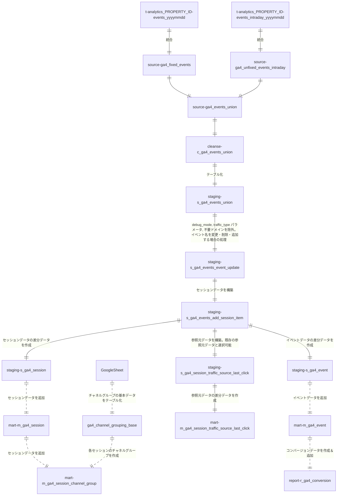

# GA4->BigQuery export data gereral queries made by Dataform.

# 各SQLXファイルの説明

| SQLXファイル名 | 対象 |
| ------------- | ------------- |
| fixed_events.sqlx | クエリ実行の7日前～前日のデータ(テーブル)が対象 |
| unfixed_events_intraday.sqlx | クエリ実行の当日のデータが対象 |
| events_union.sqlx | 上記の両データが対象 |

# ディレクトリ構成
- definitions/ga4/
    - source
       - ga4_fixed_events.sqlx
       - ga4_unfixed_events_intraday.sqlx
       - ga4_events_union.sqlx    
    - cleanse
       - c_ga4_events_union.sqlx
    - staging
       - s_ga4_events_union.sqlx
       - s_ga4_events_event_update.sqlx
       - s_ga4_events_add_session_item.sqlx
       - s_ga4_session_traffic_source_last_click_initial.slqx
       - s_ga4_session_traffic_source_last_click.slqx
       - s_ga4_event.sqlx
       - s_ga4_session.sqlx
    - mart
       - m_ga4_session_channel_group.sqlx
       - m_ga4_session_traffic_source_last_click_delete_unfixed.sqlx
       - m_ga4_session_traffic_source_last_click.slqx
       - m_ga4_events_event_update.sqlx
       - m_ga4_event_delete_unfixed.sqlx
       - m_ga4_event.sqlx
       - m_ga4_session_delete_unfixed.sqlx
       - m_ga4_session.sqlx
    - report
       - r_ga4_conversion_delete_unfixed.sqlx
       - r_ga4_conversion.sqlx

- includes/
    - constatns.js : GCPプロジェクト名、対象ホスト名などの定数をまとめたファイル
    - helpers.js : SQLXを簡略化するための関数が入ったファイル 

# Data Flow

# 処理の流れ
1. GA4からエクスポートされたテーブル（analytics_xxxxxxx.events_YYYYMMDD, analytics_xxxxxxx.events_intraday_YYYYMMDD）内のevent_paramsカラムなどをフラット化し、1つのビューにまとめる
  - definitions/ga4/sourceディレクトリ内のSQLXファイル
    * 直近4日間のデータについては、is_fixed_dataカラムをfalseとする（9以降で使用）
2. 上記で生成されたデータ（ビューの結果）に対して、下記を実施
  - definitions/ga4/cleanseディレクトリ内のSQLXファイル
    * イベントの発生時刻を日本時間に変更
    * URLからパラメータを除去したカラムを追加
    * link URLからパラメータを除去したカラムを追加
3. 上記で生成されたデータ（ビューの結果）をテーブル化（テーブル名：xxx_ga4_staging.s_ga4_events_union）
  - definitions/ga4/staging/s_ga4_events_union.sqlx
4. イベントを除外、イベントデータをカスタマイズする場合は実施（デフォルトでは何もしない）
  - definitions/ga4/staging/s_ga4_events_event_update.sqlx
    * デバッグモードや内部アクセスのイベントを除外
    * 計測対象のホスト名を指定（指定していないホスト名は除外される）
    * Measurement Protocol用のイベントがある場合は含める
5. セッション情報を追加
  - definitions/ga4/staging/s_ga4_events_add_session_item.sqlx
    * セッションの参照元情報
    * セッション時間
    * セッションごとのページビュー（スクリーンビュー）数
6. session_traffic_source_last_clickカラムから参照元データを別途作成
  - definitions/ga4/staging/s_ga4_session_traffic_source_last_click.sqlx
7. 各page_view/screen_viewイベントに関する下記のデータを追加
  - definitions/ga4/staging/s_ga4_event.sqlx
    * 前後3ページ（スクリーン）のパス
    * ページ滞在時間
    * ランディングページを判定するフラグ
    * 直帰、離脱を判定するフラグ
8. 上記7で作成したイベントデータを ga4_mart.m_ga4_event に格納
  - definitions/ga4/mart/m_ga4_event_delete_unfixed.sqlx
    * 直近分のデータを（is_fixed_dataカラムがfalse）削除
  - definitions/ga4/mart/m_ga4_event.sqlx
    * 今回作成した7の結果を追加
9. 上記5のデータ（ビュー）からセッション単位のデータを作成
  - definitions/ga4/staging/s_ga4_session.sqlx
10. 上記で作成したセッションデータを ga4_mart.m_ga4_session に格納
  - definitions/ga4/mart/m_ga4_session_delete_unfixed.sqlx
    * 直近分のデータを（is_fixed_dataカラムがfalse）削除
  - definitions/ga4/mart/m_ga4_session.sqlx
    * 上記の結果を追加
11. 上記で作成したsession_traffic_source_last_clickカラムをmartデータセット内のテーブルに格納
  - definitions/ga4/mart/m_ga4_session_traffic_source_last_click_delete_unfixed.sqlx
    * 直近分のデータを（is_fixed_dataカラムがfalse）削除
  - definitions/ga4/mart/m_ga4_session_traffic_source_last_click.sqlx
    * s_ga4_session_traffic_source_last_click.sqlxの結果を追加
12. コンバージョンデータを ga4_report.r_ga4_conversion に格納
  - definitions/ga4/mart/r_ga4_conversion_delete_unfixed.sqlx
    * 直近分のデータを（is_fixed_dataカラムがfalse）削除
  - definitions/ga4/report/r_ga4_conversion.sqlx
    * 今回はthanksを含むページに到達したイベントを対象
    * 設定箇所：includes/constants.js内で設定したCV_PAGE_LOCATION = 'https://https://moltsinc.co.jp/%thanks%';
13. セッションデータからチャネルグループを各セッションごとに作成
  - definitions/ga4/mart/m_ga4_session_channel_group.sqlx
    * もととなるテーブル（molts-data-project.general_master_us.ga4_channel_grouping_base）をGoogleシートから作成する必要あり

# 各セッションの参照元・メディア・キャンペーンなどの取得手順
1. 各イベントのcollected_traffic_source.manual_source（ない場合はevent_params内のsource）を取得。メディアやキャンペーンなども同様。※collected_traffic_sourceカラムは2023年中頃から追加されたため、それ以前の場合は下記ファイルのコメントアウト箇所を要変更。
   - 対象クエリ
    - source.ga4_fixed_events.sqlx
    - source.ga4_unfixed_events_intraday.sqlx
    - source.ga4_unfixed_events.sqlx
2. session_startイベントから上記を取得
3. 各セッションで上記1が存在する最も古いイベントから取得
4. session_startイベントに参照元が入っていれば（上記2）それを採用し、入っていない場合はイベント（上記3）から取得
   - 上記2以降の対象クエリ
     - staging.ga4_unfixed_events.sqlx
* session_traffic_source_last_clickカラムを使用したい場合は、xxx_ga4_mart.m_ga4_session_traffic_source_last_clickテーブルに格納されているので、m_ga4_eventテーブル、m_ga4_sessionテーブルとはuser_pseudo_id, ga_session_idでJOINすることで抽出可能
* チャネルグループの設定は

# 導入時に変更が必要な箇所
## includes/constants.js内
1. BigQuery関連
2. データセット: 各テーブルのデータセット名を指定
3. 集計対象ホスト名: クロスドメイントラッキングなどで複数のホスト名が集計対象となる場合は、HOSTNAME3など追加し、module.exports配列に追加
4. Measurement Protocolのイベント名 
5. コンバージョン対象: 現在はCV_PAGE_LOCATIONとしていますが、report/r_ga4_conversion.sqlx含め要変更
6. 新たに定数を作成したい場合は、このファイルで作成し、module.exports配列に追加

## イベントパラメータを追加した場合
基本的にはすべてのファイルで修正が必要
1. source/s_ga4_fixed_events.sqlx など
    event_paramsカラムから対象のパラメータを抽出
    例 114行目: ${helpers.getEventParamAll('event_category','string')}
2. cleanse/c_ga4_fixed_events.sqlx など
    上記で抽出したカラムを追加
3. staging/やmart/内のSQLXファイルも上記と同様

# 初回実行時の対応
1. mart/m_ga4_event.sqlxとmart/m_ga4_session.sqlxのtypeをtableにする
2. mart/m_ga4_event.sqlxとmart/m_ga4_session.sqlxの最後のSELECT文のWHERE句をコメントアウトして、全件対象とする
3. source/ga4_fixed_events.sqlxの最後のWHERE句で対象期間を最も古い日1日～今日の5日前に変更
4. staging/s_ga4_events_add_session_item.sqlx のサブクエリでm_ga4_sessionテーブルを参照しているので、mart_session、agg_campaign_first_3サブクエリをコメントアウトして、その下にあるagg_campaign_first_3を使用
5. mart/m_ga4_event.sqlxとmart/m_ga4_session.sqlxを実行（依存関係を含めるにチェック）
7. 1で行ったmart/m_ga4_event.sqlxとmart/m_ga4_session.sqlxのtypeをincrementalにする
8. 2で行ったmart/m_ga4_event.sqlxとmart/m_ga4_session.sqlxの最後のSELECT文のWHERE句をもとに戻す
9. 3で行ったsource/ga4_fixed_events.sqlxの最後のWHERE句で対象期間をもとに戻す（7日前～5日前）
10. 4で行ったstaging/s_ga4_events_add_session_item.sqlx をもとに戻す
11. 再びmart/m_ga4_event.sqlxとmart/m_ga4_session.sqlxを実行（依存関係を含めるにチェック）
12. 日別セッション数などを確認
 

# その他、設定変更が必要な場合に変更すべきファイル
1. GA4からエクスポートされたテーブル内のデータを利用したい場合: definitions/ga4/sourceディレクトリ内のSQLXファイル
2. すでに作成されたカラムを加工したい場合、staging/s_ga4_events_event_update.sqlx
3. 参照元情報などセッションスコープのデータを加工したい場合、staging/s_ga4_session.sqlx

