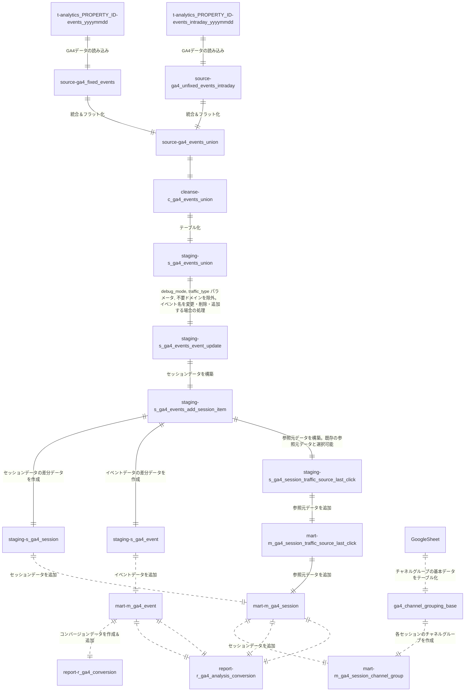

# GA4->BigQuery export data gereral queries made by Dataform.

# 各SQLXファイルの説明

| SQLXファイル名 | 対象 |
| ------------- | ------------- |
| fixed_events.sqlx | クエリ実行の7日前～前日のデータ(テーブル)が対象 |
| unfixed_events_intraday.sqlx | クエリ実行の当日のデータが対象 |
| events_union.sqlx | 上記の両データが対象 |

# ディレクトリ構成
- definitions/ga4/
    - source
       - ga4_fixed_events.sqlx
       - ga4_unfixed_events_intraday.sqlx
       - ga4_events_union.sqlx    
    - cleanse
       - c_ga4_events_union.sqlx
    - staging
       - s_ga4_events_union.sqlx
       - s_ga4_events_event_update.sqlx
       - s_ga4_events_add_session_item.sqlx
       - s_ga4_session_traffic_source_last_click.slqx
       - s_ga4_event.sqlx
       - s_ga4_session.sqlx
    - mart
       - m_ga4_session_channel_group.sqlx
       - m_ga4_session_traffic_source_last_click_delete_unfixed.sqlx
       - m_ga4_session_traffic_source_last_click.slqx
       - m_ga4_events_event_update.sqlx
       - m_ga4_event_delete_unfixed.sqlx
       - m_ga4_event.sqlx
       - m_ga4_session_delete_unfixed.sqlx
       - m_ga4_session.sqlx
    - report
       - r_ga4_conversion_delete_unfixed.sqlx
       - r_ga4_conversion.sqlx
       - r_ga4_analysis_conversion.sqlx
       - r_ga4_analysis_event_purchase.sqlx
       - r_ga4_analysis_event.sqlx
       - r_ga4_analysis_page_purchase.sqlx
       - r_ga4_analysis_page.sqlx
- includes/
    - constatns.js : GCPプロジェクト名、対象ホスト名などの定数をまとめたファイル
    - helpers.js : SQLXを簡略化するための関数が入ったファイル 


# Data Flow



# 処理の流れ
1. GA4からエクスポートされたテーブル（analytics_xxxxxxx.events_YYYYMMDD, analytics_xxxxxxx.events_intraday_YYYYMMDD）内のevent_paramsカラムなどをフラット化し、1つのビューにまとめる
    - definitions/ga4/sourceディレクトリ内のSQLXファイル
      * 直近4日間のデータについては、is_fixed_dataカラムをfalseとする（9以降で使用）
2. 上記で生成されたデータ（ビューの結果）に対して、下記を実施
    - definitions/ga4/cleanseディレクトリ内のSQLXファイル
      * イベントの発生時刻を日本時間に変更
      * URLからパラメータを除去したカラムを追加
      * link URLからパラメータを除去したカラムを追加
3. 上記で生成されたデータ（ビューの結果）をテーブル化（テーブル名：xxx_ga4_staging.s_ga4_events_union）
    - definitions/ga4/staging/s_ga4_events_union.sqlx
4. イベントを除外、イベントデータをカスタマイズする場合は実施（デフォルトでは何もしない）
    - definitions/ga4/staging/s_ga4_events_event_update.sqlx
      * デバッグモードや内部アクセスのイベントを除外
      * 計測対象のホスト名を指定（指定していないホスト名は除外される）
      * Measurement Protocol用のイベントがある場合は含める
5. セッション情報を追加
    - definitions/ga4/staging/s_ga4_events_add_session_item.sqlx
      * セッションの参照元情報
      * セッション時間
      * セッションごとのページビュー（スクリーンビュー）数
6. session_traffic_source_last_clickカラムから参照元データを別途作成
    - definitions/ga4/staging/s_ga4_session_traffic_source_last_click.sqlx
7. 各page_view/screen_viewイベントに関する下記のデータを追加
    - definitions/ga4/staging/s_ga4_event.sqlx
      * 前後3ページ（スクリーン）のパス
      * ページ滞在時間
      * ランディングページを判定するフラグ
      * 直帰、離脱を判定するフラグ
8. 上記で作成したsession_traffic_source_last_clickカラムをmartデータセット内のテーブルに格納
    - definitions/ga4/mart/m_ga4_session_traffic_source_last_click_delete_unfixed.sqlx
      * 直近分のデータを（is_fixed_dataカラムがfalse）削除
    - definitions/ga4/mart/m_ga4_session_traffic_source_last_click.sqlx
      * s_ga4_session_traffic_source_last_click.sqlxの結果を追加
9. 上記7で作成したイベントデータを ga4_mart.m_ga4_event に格納
    - definitions/ga4/mart/m_ga4_event_delete_unfixed.sqlx
      * 直近分のデータを（is_fixed_dataカラムがfalse）削除
    - definitions/ga4/mart/m_ga4_event.sqlx
      * 今回作成した7の結果を追加
10. 上記5のデータ（ビュー）からセッション単位のデータを作成
    - definitions/ga4/staging/s_ga4_session.sqlx
11. 上記で作成したセッションデータを ga4_mart.m_ga4_session に格納
    - definitions/ga4/mart/m_ga4_session_delete_unfixed.sqlx
      * 直近分のデータを（is_fixed_dataカラムがfalse）削除
    - definitions/ga4/mart/m_ga4_session.sqlx
      * 上記の結果とm_ga4_session_traffic_source_last_clickを追加
12. セッションデータからチャネルグループを各セッションごとに作成
    - definitions/ga4/mart/m_ga4_session_channel_group.sqlx
      * 必要に応じて中身を要変更
      * もととなるテーブル（molts-data-project.general_master_us.ga4_channel_grouping_base）をGoogleシートから作成する必要あり
13. コンバージョンデータを ga4_report.r_ga4_conversion に格納
    - definitions/ga4/mart/r_ga4_conversion_delete_unfixed.sqlx
      * 直近分のデータを（is_fixed_dataカラムがfalse）削除
    - definitions/ga4/report/r_ga4_conversion.sqlx
      * 今回はthanksを含むページに到達したイベントを対象
      * 設定箇所：includes/constants.js内で設定したCV_PAGE_LOCATION = 'https://https://moltsinc.co.jp/%thanks%';
14. 分析ビューを作成
    - definitions/ga4/report/r_ga4_analysis_conversion.sqlx
      * コンバージョン分析ビュー。対象イベントが発生した回数、発生したイベント数を参照元別などで集計。
    - definitions/ga4/report/r_ga4_analysis_event_purchase.sqlx
      * イベント別購入貢献ビュー。各purchaseまでに到達した全イベント（ユニークイベント）に+1。１セッション内で2回以上の購入がある場合、最初のpurchaseまでのイベント（ユニークイベント）は、購入貢献数は2。
    - definitions/ga4/report/r_ga4_analysis_event.sqlx
      * イベント分析ビュー。各セッションで各対象イベント（例：sign_up）の初回発生までに発生したイベント（例：scroll, click等）に1が加算される。
    - definitions/ga4/report/r_ga4_analysis_page_purchase.sqlx
      * ページ別購入貢献ビュー。各purchaseまでに到達した全ページ（ユニークページ）に+1。１セッション内で2回以上の購入がある場合、最初のpurchaseまでのページ（ユニークページ）は、購入貢献数は2。
    - definitions/ga4/report/r_ga4_analysis_page.sqlx
      * ページ分析ビュー。各ページのページビュー数、ページ別訪問者数、ページ別合計滞在時間、ページ別合計エンゲージメント時間。


# 各セッションの参照元・メディア・キャンペーンなどの取得手順
1. 各イベントのcollected_traffic_source.manual_source（ない場合はevent_params内のsource）を取得。メディアやキャンペーンなども同様。※collected_traffic_sourceカラムは2023年中頃から追加されたため、それ以前の場合は下記ファイルのコメントアウト箇所を要変更。
   - 対象クエリ
      - source.ga4_fixed_events.sqlx
      - source.ga4_unfixed_events_intraday.sqlx
      - source.ga4_unfixed_events.sqlx
2. session_startイベントから上記を取得
3. 各セッションで上記1が存在する最も古いイベントから取得
4. session_startイベントに参照元が入っていれば（上記2）それを採用し、入っていない場合はイベント（上記3）から取得
   - 上記2以降の対象クエリ
     - staging.ga4_unfixed_events.sqlx
**session_traffic_source_last_clickカラムを使用したい場合は、xxx_ga4_mart.m_ga4_session_traffic_source_last_clickテーブルに格納されているので、m_ga4_eventテーブル、m_ga4_sessionテーブルとはuser_pseudo_id, ga_session_idでJOINすることで抽出可能**

# チャネルグループの作成＆カスタマイズ
1. Googleシートを作成（例：https://docs.google.com/spreadsheets/d/16iDnq9G07HcQ5O09W5OTEPIaq5lbafS8Qw9JGk0179U/edit?gid=0#gid=0 ）参考：https://support.google.com/analytics/answer/9756891?hl=ja
2. 上記のGoogleシートを参照するテーブルを作成
	1. BigQuery Studioにて該当のプロジェクトを開く
	2. データセットを作成（名前は任意：例 general_master）
		 - リージョンは他のデータセットと同じにする（例 東京：asia-northeast1）
	 3. テーブルを作成
		  - ソース
		      - テーブルの作成元：ドライブ
		      - ドライブのURI：GoogleシートのURL
		      - ファイル形式：Googleスプレッドシート
		      - シート範囲：空欄でOK
	     - 送信先
		      - プロジェクト：デフォルトのまま
		      - データセット：デフォルトのまま
		      - テーブル名：任意
	4. Googleシートへのアクセス権限がないユーザー・サービスアカウントはこのテーブルを使えない可能性があるため、その場合は、上記のテーブルをコピーしてテーブルを作成。
		例： 
		```
		CREATE OR REPLACE TABLE  `プロジェクト名.データセット名.新しいテーブル名`
		SELECT * FROM `プロジェクト名.データセット名.上記のGoogleシートで作成したテーブル名`
		  ```
		  ただし、https://support.google.com/analytics/answer/9756891?hl=ja にある定義が更新された場合は手動でこの新しいテーブルにデータを追加する必要がある
3. includes/ga4/constants.js内の`CHANNEL_GROUP_TABLE`変数の値を上記で作成したテーブルに変更
4. definitions/ga4/mart/m_ga4_session_channel_group.sqlx 内で独自ルールを入れるなど要変更
	 - 85行目以降：custom_channel_group：各サイトでの要件にあわせて変更
	 - 119行目以降：lp_group：各サイトのLPにあわせて変更
	 - 125行目以降：domain：各サイトごとのドメインやサブドメインのグループ分けの定義にあわせて変更

# 導入時に変更が必要な箇所
## includes/constants.js内すべて
1. GA4テーブルがあるプロジェクト
2. データセット: 各テーブルのデータセット名とプロジェクト名を指定
3. 集計対象ホスト名: クロスドメイントラッキングなどで複数のホスト名が集計対象となる場合は、HOSTNAME3など追加し、module.exports配列に追加
4. Measurement Protocolのイベント名 
5. コンバージョン対象: 現在はCV_PAGE_LOCATIONとしていますが、report/r_ga4_conversion.sqlx含め要変更
6. 新たに定数を作成したい場合は、このファイルで作成し、module.exports配列に追加

## イベントパラメータを追加した場合
**基本的にはすべてのファイルで修正が必要**
1. source/s_ga4_fixed_events.sqlx など
    - event_paramsカラムから対象のパラメータを抽出
    例 114行目: ${helpers.getEventParamAll('event_category','string')}
2. cleanse/c_ga4_fixed_events.sqlx など
    - 上記で抽出したカラムを追加
3. staging/やmart/内のSQLXファイルも上記と同様

# 初回実行時（過去データのインポート、m_ga4_event、m_ga4_sessionテーブルの新規作成等）の対応
1. includes/constants.jsの更新（前述）
2. チャネルグループ用のテーブルの作成（前述）
3. source/ga4_fixed_events.sqlx
    1. 最後のWHERE句で対象期間を最も古い日～前日に変更（デフォルトは7日前～前日）
      例： _table_suffix >= FORMAT_DATE("%Y%m%d", DATE_SUB(CURRENT_DATE('Asia/Tokyo'), INTERVAL 1 DAY))
4. staging/s_ga4_events_add_session_item.sqlx
   1. サブクエリでm_ga4_sessionテーブルを参照している場合、mart_session、agg_campaign_first_3サブクエリをコメントアウトして、その下にあるagg_campaign_first_3を使用（※これが見つからない場合はここは省略可）
      詳細はs_ga4_events_add_session_item.sqlxに記載
5. mart/m_ga4_session_traffic_source_last_click.sqlx
   1. 最初にあるtypeをincrementalからtableに変更
   2. 16行目あたりのdependencies: ["m_ga4_session_traffic_source_last_click_delete_unfixed"]をコメントアウト（//を先頭に入れる）
6. mart/m_ga4_event.sqlx、mart/m_ga4_session.sqlx
   1. 最初にあるtypeをincrementalからtableに変更
   2. 12行目あたりのdependencies: ["m_ga4_xxxxx_delete_unfixed"]をコメントアウト（//を先頭に入れる）
7. report/r_ga4_conversion.sqlx
   1. 最初にあるtypeをincrementalからtableに変更
   2. 12行目あたりのdependencies: ["r_ga4_conversion_delete_unfixed"]をコメントアウト（//を先頭に入れる）
8. 実行
    1. 上部の「実行を開始」ボタンをクリックし、「タグ」＞ 「workflow」を選択
    2. 「SELECTION OF TAGS」が選択されていることを確認
        - 「実行するタグ」で「workflow」が選択されていることを確認
    3. 「依存関係を含める」にチェック
    4. 「実行対象として 5 個のアクションが選択されています」に下記5つのファイルがあることを確認
        - mart/m_ga4_event.sqlx
        - mart/m_ga4_session.sqlx
        - mart/m_ga4_session_traffic_source_last_click.sqlx
        - mart/m_ga4_session_channel_group.sqlx
        - report/r_ga4_conversion.sqlx 
    5. 下の「実行を開始」ボタンをクリックして実行開始
    6. 「ワークフロー実行を作成しました 詳細」というダイアログが下部に表示されるので、「詳細」をクリック
    7. ステータスが表示されるので、「更新」ボタンを押して、ステータスが「成功」になればOK。失敗した場合は、エラーマークが付いているクエリの右側の「詳細」をクリックし、エラー箇所を確認。該当箇所のSQLXファイルを要修正。修正後再び6-1から再実施
9. 実行完了後、設定を元に戻す
    1. 3のsource/ga4_fixed_events.sqlxの期間
    2. 4のstaging/s_ga4_events_add_session_item.sqlxのサブクエリ
    3. 5のmart/m_ga4_session_traffic_source_last_click.sqlxのtype、SELECT文 
    4. 5のmart/m_ga4_event.sqlx、mart/m_ga4_session.sqlxのconfig（type、denpendencies） 
    5. 6のreport/r_ga4_conversion.sqlxのconfig（type、denpendencies） 
10. 再びm_ga4_event.sqlxとm_ga4_session.sqlx、m_ga4_session_traffic_source_last_click.sqlxを選択して実行
    1. 実行前にm_ga4_eventテーブルとm_ga4_sessionテーブルをコピーしておく（バックアップを取っておく）
    2. 前述の「実行」と同じやり方でOK
    3. 実行完了後、m_ga4_eventテーブルとm_ga4_sessionテーブルをevent_date別で件数を調べ、コピーしたテーブルと比較。
        - 5日前～前日のデータ件数がコピーしたテーブルよりも大きい場合：7のどこかで作業が漏れている（例：xxxx_delete_unfixed.sqlxが実行されていない可能性が高い）
        - 6日前よりも古いデータがない場合：type:tableのままになっている

# 日次更新（ワークフロー）の設定
  1. Dataformのメインページ（https://console.cloud.google.com/bigquery/dataform?authuser=0&project=molts-data-project ）からリポジトリを選択
  2. 「リリースとスケジュール」タブをクリック
  3. 「リリース構成」の横にある「作成」をクリックし、下記を入力した後、「保存」ボタンを押す
	   - リリースID：任意
	   - 頻度：毎日
	   - タイムゾーン：任意（日本）
	   - Google Cloud プロジェクト リリースID：空欄
	   - スキーマの接尾辞：空欄
	   - テーブルの接頭辞：空欄
  4. 「ワークフロー構成」の横にある「作成」をクリック
	   - リリース構成： 上記で作成したリリースを選択
	   - サービスアカウント：デフォルトのサービスアカウント（Googleシートで作成したテーブルへ参照できない場合は、参照可能かつDataformを実行できるアカウントに要変更）
	   - 頻度：任意（例：毎朝11時の場合 0 11 * * *）※GA4のテーブルが生成される時間を調べて決めるべき
	   - タイムゾーン：日本 
	   - 「SELECTION OF TAGS」を選択
	     - 実行するタグを選択：workflow 
	     - 「依存関係を含める」にチェック
	   - 下の「保存」ボタンをクリック

# エンゲージメントの定義
セッション単位のエンゲージメントについては下記のカラムを使用。GA4の定義では`is_bounce_no_engagement_manual`が正しいが、GA4のレポートの結果に合わせる場合は、 `is_bounce_no_engagement` を使用。（それでも若干誤差はある）
| カラム名 | 定義 | 値 | 意味 |
| ------------- | ------------- | ------------- | ------------- |
| is_bounce_no_engagement | セッション内にsession_engagedパラメータが1であるイベントが1個もない | TRUE | エンゲージメントがないセッション|
||| FALSE | エンゲージメントがあるセッション |
| is_bounce_no_engagement_manual | セッションの時間が10秒未満またはセッション内のページビュー（スクリーンビュー）数が2未満| TRUE | エンゲージメントがないセッション|
||| FALSE | エンゲージメントがあるセッション |

# ページ分析ビュー、イベント分析ビューの設定
## 1. `definitions/ga4/report/r_ga4_analysis_conversion.sqlx`
- **説明**: コンバージョン分析ビュー。
- **概要**: 対象イベント（コンバージョン）が発生した回数を参照元別などで集計。
- **対象イベント**: `sign_up`, `download_form` など（※`constants.js`にて設定）

## 2. `definitions/ga4/report/r_ga4_analysis_event_purchase.sqlx`
- **説明**: イベント別購入貢献ビュー。
- **詳細**:
  - **attributePurchase**: 購入貢献数。各 `purchase` までに到達した全イベント（ユニークイベント）に +1。1セッション内で2回以上購入がある場合、最初の `purchase` までのイベント（ユニークイベント）は購入貢献数 2。
  - **attributeSessionizedPurchase**: 購入貢献セッション数。1セッション内で複数回購入しても 1。
  - **attributePurchase_revenue**: 貢献金額。各 `purchase` までに到達した全イベント（ユニークイベント）に売上金額が加算される。1セッション内で2回以上購入がある場合、最初の `purchase` までのイベント（ユニークイベント）は 1回目と 2回目の合計売上金額。

## 3. `definitions/ga4/report/r_ga4_analysis_event.sqlx`
- **説明**: イベント分析ビュー。
- **詳細**:
  - **貢献イベントの定義**: 各セッションで対象イベントの初回発生までに発生したイベントに +1。
  - **attributeEvents_sign_up**: 各セッション内で `sign_up` イベントが初回発生するまでに発生したイベント数。複数回発生した場合、その回数分カウント。
  - **attributeSessionized_sign_up**: 各セッション内で `sign_up` イベントが初回発生するまでに発生したセッション数。複数回発生しても 1としてカウント。
- **対象イベント**: `sign_up`, `generate_lead` など（※`constants.js`にて設定）

## 4. `definitions/ga4/report/r_ga4_analysis_page_purchase.sqlx`
- **説明**: ページ別購入貢献ビュー。
- **詳細**:
  - **attributePurchase**: 購入貢献数。各 `purchase` までに到達した全ページ（ユニークページ）に +1。1セッション内で2回以上の購入がある場合、最初の `purchase` までのページ（ユニークページ）は購入貢献数 2。
  - **attributeSessionizedPurchase**: 購入貢献セッション数。1セッション内で複数回購入しても 1。
  - **attributePurchase_revenue**: 貢献金額。各 `purchase` までに到達した全イベント（ユニークイベント）に売上金額が加算される。1セッション内で2回以上の購入がある場合、最初の `purchase` までのイベント（ユニークイベント）は 1回目と 2回目の合計売上金額。

## 5. `definitions/ga4/report/r_ga4_analysis_page.sqlx`
- **説明**: ページ分析ビュー。
- **詳細**:
  - **page_views**: ページビュー数。
  - **unique_page_views**: ページ別訪問数（ページを訪問したセッション数）。
  - **sum_page_visit_time_msec**: ページ別合計滞在時間（ミリ秒）。※平均滞在時間は `sum_page_visit_time_msec/page_views` で算出。
  - **sum_engagement_time_msec**: ページ別合計エンゲージメント時間（ミリ秒）。※平均時間は `sum_engagement_time_msec/page_views` で算出。
  - **attributeEvents_sign_up**: 各セッション内で `sign_up` イベントが初回発生するまでにイベントが発生したイベント数。複数回閲覧しても 1としてカウント。（対象CV：各CVの最初のCVまで。CVに到達するまでの全ページに +1（複数回ページビューがあっても 1））
- **対象イベント**: `sign_up`, `generate_lead` など（※`constants.js`にて設定）
